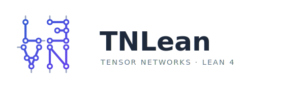

<p align="center">
  
</p>

<p align="center">
  <b>The mathematics of tensor networks, machine-checked in Lean 4</b><br>
  from quantum channels to the Fundamental Theorem of Matrix Product States —
  every proof verified by the computer.
</p>

[](https://github.com/LionSR/TNLean/actions/workflows/lean_action_ci.yml)
[](https://github.com/LionSR/TNLean/actions/workflows/blueprint.yml)


Tensor networks are the language physicists use to describe quantum many-body
systems — and the theorems behind them are subtle enough that even experts get them
wrong.  **TNLean** rebuilds this theory inside the [Lean 4](https://lean-lang.org/)
proof assistant, so that every statement is checked by the computer down to the
axioms.  No hand-waving, no "it can be shown": a result that compiles here is a
result that is true.

Its centrepiece is the **Fundamental Theorem of Matrix Product States** — the
statement that two matrix-product descriptions yield the same physical state only
when a simple change of basis (a "gauge") relates them.  Around it grows a sizeable
formal development of the surrounding theory: quantum channels, Perron--Frobenius
and quantum Wielandt theory, parent Hamiltonians, matrix-product density operators,
renormalization fixed points, and projected entangled pair states.

Built on [Mathlib](https://github.com/leanprover-community/mathlib4) (Lean 4 /
Mathlib `v4.31.0`), the whole library loads with a single line:

```lean
import TNLean
```

This is an active research formalization, not a finished textbook.  Some of the more
advanced files still contain unfinished proofs (`sorry`) or results assumed rather
than proved (axioms); the badges above track the current counts, and the sections
below are explicit about what is fully proved and what is still being built.

## Mathematical scope

### Matrix product states and the Fundamental Theorem

An MPS describes a quantum state of a chain of sites by placing a matrix at each
site and multiplying them together.  The library defines these tensors
(`MPSTensor d D`) and the basic operations on them, and proves the **single-block
Fundamental Theorem**: if a tensor is "injective" (its matrices are rich enough to
span everything) and two tensors describe the same state, then one is a gauge
transformation of the other.

```lean
theorem MPSTensor.fundamentalTheorem_singleBlock {A B : MPSTensor d D}
    (hA : IsInjective A) (hAB : SameMPV A B) : GaugeEquiv A B
```

Building on this, the library treats the general (multi-block) case, where a state
decomposes into several injective pieces, and the *canonical form* that makes such
a decomposition unique.  The precise hypotheses of each theorem are stated in its
Lean signature.

### Quantum channels and Perron--Frobenius theory

Following Wolf's *Quantum Channels & Operations*, the library develops the theory
of quantum channels on finite-dimensional matrix algebras: the standard
representations (Choi, Kraus, Stinespring), Schwarz inequalities, fixed-point
structure, irreducibility, peripheral spectra, and quantum Markov semigroups.  The
coverage is selective — the chapters most relevant to MPS are the most developed —
and a few deep inputs (such as strong subadditivity of entropy) are taken as given
rather than reproved from scratch.

A recurring tool is the quantum Perron--Frobenius theorem: every positive map has a
positive-semidefinite eigenvector with positive eigenvalue, proved here via a
Brouwer fixed-point argument on density matrices.

```lean
theorem exists_posSemidef_eigenvector [NeZero D]
    (E : Matrix (Fin D) (Fin D) ℂ →ₗ[ℂ] Matrix (Fin D) (Fin D) ℂ)
    (hpos : IsPositiveMap E)
    (hNZ : ∀ {ρ : Matrix (Fin D) (Fin D) ℂ}, ρ.PosSemidef → ρ ≠ 0 → E ρ ≠ 0) :
    ∃ (ρ : Matrix (Fin D) (Fin D) ℂ) (r : ℝ),
      ρ.PosSemidef ∧ ρ ≠ 0 ∧ 0 < r ∧ E ρ = (r : ℂ) • ρ
```

### Quantum Wielandt theory

The quantum Wielandt inequality controls how quickly products of a tensor's
matrices span the whole matrix algebra.  A central result here is that for a normal
tensor the spanning length is at most $D^2$, where $D$ is the bond dimension:

```lean
theorem cumulativeSpan_eq_top_of_isNormal_bound [NeZero D]
    (A : MPSTensor d D) (hN : IsNormal A) :
    cumulativeSpan A (D ^ 2) = ⊤
```

Sharpening this bound to match the constants in the literature is ongoing.

### Parent Hamiltonians, density operators, PEPS, and examples

Beyond the core, the library reaches into several neighbouring topics, each at an
earlier stage:

- **Parent Hamiltonians.** Local Hamiltonians whose ground space is the MPS, with
  frustration-freeness and uniqueness of the ground state proved for injective or
  normal tensors.  The estimates that would yield a spectral gap are not yet done.
- **Matrix-product density operators.** Mixed-state analogues of MPS, their
  canonical and zero-correlation-length forms, and renormalization fixed points —
  developed as a foundation, not yet a complete classification.
- **Projected entangled pair states (PEPS).** The two-dimensional generalization of
  MPS, with the relevant definitions in place and a proof of the corresponding
  Fundamental Theorem still to come.
- **Examples.** Concrete states such as AKLT, GHZ, even parity, and the
  $\mathbb{Z}/2\mathbb{Z}$ models, alongside algebraic variants of the Fundamental
  Theorem.

Where a formal statement does not exactly match its source, the discrepancy is
recorded as a mathematical note under `docs/paper-gaps/`.

## Organization of the source

The file `TNLean.lean` collects everything that is imported as one library;
legacy material in `TNLean/Archive/` is kept out of it.  The source is grouped
roughly as follows.

| Path | Contents |
|---|---|
| `TNLean/Algebra`, `TNLean/Analysis`, `TNLean/Topology` | Linear algebra of matrices: traces, Gram matrices, Frobenius norms, Skolem--Noether, and convergence and fixed-point results. |
| `TNLean/Axioms`, `TNLean/Entropy` | Inputs taken as given (Brouwer's theorem, strong subadditivity of entropy) and consequences drawn from them. |
| `TNLean/Channel` | Quantum channels: their representations, Schwarz theory, fixed points, irreducibility, peripheral spectra, and semigroups. |
| `TNLean/QPF`, `TNLean/Spectral` | Perron--Frobenius theory, spectral gaps, and correlation-decay estimates. |
| `TNLean/MPS/Core`, `TNLean/MPS/Chain`, `TNLean/MPS/Overlap` | Matrix product states: tensors, words, blocking, transfer maps, and overlap matrices. |
| `TNLean/MPS/FundamentalTheorem`, `.../BNT`, `.../CanonicalForm`, `.../Periodic`, `.../Structure`, `.../Irreducible` | The Fundamental Theorem in its single-block, multi-block, canonical-form, and periodic versions. |
| `TNLean/MPS/Symmetry` | Symmetries of MPS: on-site and virtual symmetry, cohomology of cocycles, and string order. |
| `TNLean/MPS/ParentHamiltonian` | Parent Hamiltonians, their ground spaces, and uniqueness of the ground state. |
| `TNLean/MPS/MPDO`, `TNLean/MPS/RFP` | Matrix-product density operators and renormalization fixed points. |
| `TNLean/MPS/Examples` | Worked examples (AKLT, GHZ, even parity, $\mathbb{Z}/2\mathbb{Z}$). |
| `TNLean/Wielandt` | The quantum Wielandt inequality and primitivity. |
| `TNLean/PEPS` | Projected entangled pair states on finite graphs. |
| `TNLean/PiAlgebra` | Algebraic variants of the Fundamental Theorem. |
| `blueprint/`, `docs/` | The mathematical companion text, conventions, and notes on gaps from the sources. |

## Status

Because the formalization is still growing, the README does not try to track which
individual results are complete.  The authoritative, always-current picture is:

- the `sorries` and `axioms` badges at the top of this page, for the count of
  unfinished proofs and assumed results;
- the blueprint, which marks each theorem as formalized or not; and
- `docs/paper-gaps/`, which records where a formal statement diverges from its
  cited source.

## Building

The Lean version is pinned by `lean-toolchain`; Mathlib is pinned in
`lakefile.toml` and `lake-manifest.json`.

```bash
# Optional but recommended: download pre-built Mathlib artifacts.
lake exe cache get

# Build the default target, which is TNLean.
lake build

# Equivalently, build the public Lean library target.
lake build TNLean

# Check a single file during development.
lake env lean TNLean/MPS/FundamentalTheorem/Basic.lean
```

Repository-specific notes from past Lean/Mathlib upgrades are collected in
[`docs/upgrade_4_29.md`](docs/upgrade_4_29.md).

## Blueprint and documentation

The blueprint in `blueprint/` is the mathematical companion to the formalization:
it states the definitions and theorems in ordinary mathematical language and links
each one to its Lean proof.  It is built with `leanblueprint` on top of a
successful `lake build`:

```bash
lake build TNLean
cd blueprint
leanblueprint checkdecls
leanblueprint web   # or: leanblueprint pdf / leanblueprint all
```

Conventions for contributors are collected in `AGENTS.md`, `CLAUDE.md`, and
`docs/`.

## References

The formalization draws principally on the following sources.

- D. Pérez-García, F. Verstraete, M. M. Wolf, J. I. Cirac,
  *Matrix Product State Representations*,
  [arXiv:quant-ph/0608197](https://arxiv.org/abs/quant-ph/0608197),
  Quantum Inf. Comput. **7** (2007).
- M. Sanz, D. Pérez-García, M. M. Wolf, J. I. Cirac,
  *A quantum version of Wielandt's inequality*,
  [arXiv:0909.5347](https://arxiv.org/abs/0909.5347),
  IEEE Trans. Inf. Theory **56**(9), 4668--4673 (2010).
- J. I. Cirac, D. Pérez-García, N. Schuch, F. Verstraete,
  *Matrix Product Density Operators: Renormalization Fixed Points and Boundary Theories*,
  [arXiv:1606.00608](https://arxiv.org/abs/1606.00608),
  Ann. Phys. **378**, 100--149 (2017).
- G. De las Cuevas, J. I. Cirac, N. Schuch, D. Pérez-García,
  *Irreducible forms of Matrix Product States: Theory and Applications*,
  [arXiv:1708.00029](https://arxiv.org/abs/1708.00029),
  J. Math. Phys. **58**, 121901 (2017).
- J. I. Cirac, D. Pérez-García, N. Schuch, F. Verstraete,
  *Matrix Product States and Projected Entangled Pair States*,
  [arXiv:2011.12127](https://arxiv.org/abs/2011.12127),
  Rev. Mod. Phys. **93**, 045003 (2021).
- A. Molnár, J. Garre-Rubio, D. Pérez-García, N. Schuch, J. I. Cirac,
  *Normal projected entangled pair states generating the same state*,
  [arXiv:1804.04964](https://arxiv.org/abs/1804.04964),
  New J. Phys. **20**, 113017 (2018).
- D. Pérez-García, M. M. Wolf, M. Sanz, F. Verstraete, J. I. Cirac,
  *String Order and Symmetries in Quantum Spin Lattices*,
  [arXiv:0802.0447](https://arxiv.org/abs/0802.0447),
  Phys. Rev. Lett. **100**, 167202 (2008).
- C. Fernández-González, N. Schuch, M. M. Wolf, J. I. Cirac, D. Pérez-García,
  *Frustration free gapless Hamiltonians for Matrix Product States*,
  [arXiv:1210.6613](https://arxiv.org/abs/1210.6613),
  Commun. Math. Phys. **333**, 299--333 (2015).
- N. Schuch, I. Cirac, D. Pérez-García,
  *PEPS as ground states: Degeneracy and topology*,
  [arXiv:1001.3807](https://arxiv.org/abs/1001.3807),
  Ann. Phys. **325**, 2153--2192 (2010).
- J. I. Cirac, J. Garre-Rubio, D. Pérez-García,
  *Mathematical open problems in projected entangled pair states*,
  [arXiv:1903.09439](https://arxiv.org/abs/1903.09439),
  Rev. Mat. Complut. **32**, 579--599 (2019).
- M. M. Wolf, *Quantum Channels & Operations: Guided Tour* (2012).
- [Mathlib4](https://github.com/leanprover-community/mathlib4), the Lean 4
  mathematics library.
