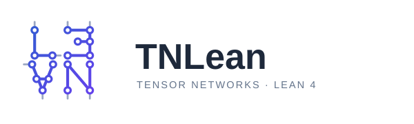

<p align="center">
  
</p>

<p align="center">
  <b>Tensor-network theory, formalized in Lean 4.</b>
</p>

[](https://github.com/LionSR/TNLean/actions/workflows/pr-ci.yml)
[](https://github.com/LionSR/TNLean/actions/workflows/blueprint.yml)


<p align="center">
  <a href="https://sirui-lu.com/TNLean/blueprint/">Blueprint</a> ·
  <a href="https://sirui-lu.com/TNLean/docs/">Documentation</a> ·
  <a href="https://sirui-lu.com/TNLean/paper-gaps/">Paper-gap notes</a>
</p>

TNLean is a [Lean 4](https://lean-lang.org/) library, built on
[Mathlib](https://github.com/leanprover-community/mathlib4), that formalizes
the mathematics of tensor networks: matrix product states (MPS), their
canonical forms and gauge structure, and the theorems that classify them. The
quantum-information theory this rests on lives in the companion library
[QICLean](https://github.com/LionSR/QICLean), which TNLean builds on. Blueprint
diagrams are drawn by the companion package
[tenkz](https://github.com/LionSR/tenkz), pinned from `tenkz.toml`. Every
result is checked by Lean down to the axioms it assumes.

The first released part of the library is the **fundamental theorem of matrix
product states** (Pérez-García, Verstraete, Wolf, Cirac 2007; Cirac,
Pérez-García, Schuch, Verstraete 2017): two tensors generate the same quantum
states at every system size exactly when an invertible change of basis on the
bond indices, a gauge transformation, relates them. Proving this required
formalizing the quantum-information theory the proof rests on — channel
representations, Schwarz inequalities, quantum Perron-Frobenius theory, and
the quantum Wielandt inequality — now developed in
[QICLean](https://github.com/LionSR/QICLean) following Wolf's *Quantum
Channels & Operations*. The library also contains material beyond the fundamental
theorem, at varying levels of completeness; the sections below say what is
proved and what is not.

The mathematics is written up in the
[blueprint](https://sirui-lu.com/TNLean/blueprint/), which states each
definition and theorem in ordinary mathematical language and links it to the
Lean proof. It is available as a
[web version](https://sirui-lu.com/TNLean/blueprint/), a
[full PDF](https://sirui-lu.com/TNLean/blueprint.pdf), and a
[separate FT-MPS PDF](https://sirui-lu.com/TNLean/blueprint-ch01-12.pdf),
the fundamental-theorem part that is being released first. The generated
[API documentation](https://sirui-lu.com/TNLean/docs/) covers every
declaration in the Lean source.

New to the repository? [`docs/getting_started.md`](docs/getting_started.md)
walks through building the library, finding your way around the source, and
making a first contribution.

The agent-driven workflow used to build this library is described in the
companion paper: S. Lu, E. Tjoa, J. I. Cirac, *Multi-agent Autoformalization
of Tensor Network Theory*,
[arXiv:2607.07857](https://arxiv.org/abs/2607.07857). Most of the
formalization was carried out by agents running on
[TeXRA](https://texra.ai), whose `lean-env-action` also sets up the Lean and
blueprint toolchain used in the workflows under `.github/workflows/`.

The library loads as a single import (Lean 4 / Mathlib `v4.34.0-rc1`):

```lean
import TNLean
```

This is a research formalization in progress, not a finished textbook. Some
files contain unfinished proofs (`sorry`) or results assumed as axioms; the
badges above track the current counts.

## What is proved

### The fundamental theorem of matrix product states

An MPS describes a quantum state on a chain by assigning a matrix `A^i` to
each local basis state; products of these matrices give the state's
coefficients. The library defines these tensors (`MPSTensor d D`) and proves
the fundamental theorem in both of its forms.

The single-block case: if a tensor is injective (its matrices span the full
matrix algebra) and two tensors generate the same states, then they are
related by a gauge transformation.

```lean
theorem MPSTensor.fundamentalTheorem_singleBlock {A B : MPSTensor d D}
    (hA : IsInjective A) (hAB : SameMPV A B) : GaugeEquiv A B
```

The general case: an arbitrary tensor decomposes into normal blocks, and the
library constructs this canonical form, the basis of normal tensors that
makes it unique, and the multi-block theorem
(`MPSTensor.fundamentalTheorem_equal_canonicalForm`): two canonical forms
generating the same states at every length are related by a single invertible
gauge. The exact hypotheses of each theorem are stated in its Lean signature
and in the blueprint.

As a first physics application, the library proves that an on-site symmetry
of an injective MPS induces a projective representation on the bond space,
whose cohomology class is a well-defined invariant of the symmetric tensor.
This is the MPS ingredient in the classification of one-dimensional
symmetry-protected topological phases.

### The quantum-information layer

The quantum channels, Kadison-Schwarz inequalities, quantum Perron-Frobenius
theory, and spectral results that MPS theory runs on are developed in
[QICLean](https://github.com/LionSR/QICLean), which TNLean imports as an
ordinary Lake dependency. TNLean keeps the tensor-side statements: transfer
operators of MPS tensors, their spectral gaps, and the overlap and
correlation-decay estimates phrased in terms of states.

### Quantum Wielandt theory

The quantum Wielandt inequality controls how quickly products of a tensor's
matrices span the whole matrix algebra, which determines the blocking length
after which a normal tensor becomes injective. For a normal tensor the
library proves a spanning length of at most `D^2`, where `D` is the bond
dimension:

```lean
theorem cumulativeSpan_eq_top_of_isNormal_bound [NeZero D]
    (A : MPSTensor d D) (hN : IsNormal A) :
    cumulativeSpan A (D ^ 2) = ⊤
```

The channel-generic form of this theory lives in QICLean; TNLean keeps the
tensor-typed statements the canonical-form machinery consumes. Sharpening
the bound to match the constants in the literature is ongoing.

## What is in progress

Beyond the released core, the library develops several neighboring topics,
each at an earlier stage.

- **Parent Hamiltonians.** Local Hamiltonians whose ground space is the MPS,
  with frustration-freeness and ground-state uniqueness proved for injective
  and normal tensors. The estimates that would give a spectral gap are not
  yet done.
- **Matrix-product density operators.** Mixed-state analogues of MPS, their
  canonical and zero-correlation-length forms, and renormalization fixed
  points. This is a foundation, not yet a complete classification.
- **Projected entangled pair states (PEPS).** The two-dimensional
  generalization of MPS, with fundamental-theorem results for normal PEPS on
  finite graphs.
- **Matrix-product unitaries and quantum cellular automata.** Standard forms
  of MPU tensors and finite-propagation automorphisms of spin chains.
- **Examples.** Concrete states such as AKLT, GHZ, even parity, and the
  $\mathbb{Z}/2\mathbb{Z}$ models, alongside algebraic variants of the
  fundamental theorem.

Where a formal statement does not exactly match its cited source, the
discrepancy is recorded as a mathematical note under `docs/paper-gaps/`,
published at [sirui-lu.com/TNLean/paper-gaps](https://sirui-lu.com/TNLean/paper-gaps/).

## Organization of the source

The generated file `TNLean.lean` collects everything imported as one library;
legacy material in `TNLean/Archive/` is kept out of it. Directory aggregators
are generated too. Never edit these aggregators by hand. After adding, moving,
or removing a production `.lean` file, regenerate and check them with:

```bash
python3 scripts/generate_import_aggregators.py
python3 scripts/generate_import_aggregators.py --check
```

See [`docs/import_structure.md`](docs/import_structure.md) for the hierarchy and
Archive policy. The source is grouped as follows.

| Path | Contents |
|---|---|
| `TNLean/Algebra` | Matrix algebra specific to the fundamental theorem: trace pairings, Gram matrices, Skolem-Noether, Burnside's theorem, and cocycle cohomology. |
| `TNLean/Spectral` | Transfer-operator spectral gaps, overlap matrices, and correlation-decay estimates for MPS. |
| `TNLean/MPS/Core`, `TNLean/MPS/Chain`, `TNLean/MPS/Overlap` | Matrix product states: tensors, words, blocking, transfer maps, and overlap matrices. |
| `TNLean/MPS/FundamentalTheorem`, `.../BNT`, `.../CanonicalForm`, `.../Periodic`, `.../Structure`, `.../Irreducible` | The fundamental theorem in its single-block, multi-block, canonical-form, and periodic versions. |
| `TNLean/MPS/Symmetry` | On-site and virtual symmetry, cohomology of cocycles, and string order. |
| `TNLean/MPS/ParentHamiltonian` | Parent Hamiltonians, their ground spaces, and uniqueness of the ground state. |
| `TNLean/MPS/MPDO`, `TNLean/MPS/RFP` | Matrix-product density operators and renormalization fixed points. |
| `TNLean/MPS/Examples` | Worked examples (AKLT, GHZ, even parity, $\mathbb{Z}/2\mathbb{Z}$). |
| `TNLean/MPS/MPU`, `TNLean/QCA` | Matrix-product unitaries and quantum cellular automata. |
| `TNLean/Wielandt` | The quantum Wielandt inequality and primitivity for MPS tensors. |
| `TNLean/PEPS` | Projected entangled pair states on finite graphs. |
| `TNLean/PiAlgebra` | Algebraic variants of the fundamental theorem. |
| `blueprint/`, `docs/` | The mathematical companion text, conventions, and notes on gaps from the sources. |

## Status

The README does not track which individual results are complete; the
authoritative, always-current picture is:

- the `sorries` and `axioms` badges at the top of this page, counting
  unfinished proofs and assumed results;
- the [blueprint](https://sirui-lu.com/TNLean/blueprint/), which marks
  each theorem as formalized or not; and
- the [paper-gap notes](https://sirui-lu.com/TNLean/paper-gaps/) (`docs/paper-gaps/`), which record where a formal statement diverges from
  its cited source.

## Building

The Lean version is pinned by `lean-toolchain`; Mathlib is pinned in
`lakefile.toml` and `lake-manifest.json`.

```bash
# Optional but recommended: download pre-built Mathlib artifacts.
lake exe cache get

# Build the default target, which is TNLean.
lake build

# Equivalently, build the public Lean library target.
lake build TNLean

# Verify one module with the package Lean options and Mathlib standard linters.
lake build TNLean.MPS.FundamentalTheorem.Basic

# Optional fast elaboration only; this does not apply the package Lean options.
lake env lean TNLean/MPS/FundamentalTheorem/Basic.lean
```

Repository-specific notes from past Lean/Mathlib upgrades are collected in
[`docs/upgrade_4_29.md`](docs/upgrade_4_29.md).

## Blueprint and documentation

The blueprint in `blueprint/` states the definitions and theorems in ordinary
mathematical language and links each one to its Lean proof. It is built with
`leanblueprint` on top of a successful `lake build`:

```bash
lake build TNLean
python3 scripts/fetch_tenkz.py
cd blueprint
leanblueprint checkdecls
leanblueprint web   # or: leanblueprint pdf / leanblueprint all
```

The FT-MPS release volume is built by
`scripts/build_blueprint_ch01_12.sh` and published automatically with the
rest of the site.

Conventions for contributors are collected in `AGENTS.md`, `CLAUDE.md`, and
`docs/`.

## License

The Lean source, the blueprint, and the other original content of this
repository are released under the Apache License 2.0 (see
[`LICENSE`](LICENSE)). The `Papers/` directory contains the arXiv sources of
the papers being formalized; these are third-party works that remain under
their authors' copyright and are **not** covered by the repository license.
See [`Papers/NOTICE.md`](Papers/NOTICE.md).

## References

The formalization draws principally on the following sources.

- D. Pérez-García, F. Verstraete, M. M. Wolf, J. I. Cirac,
  *Matrix Product State Representations*,
  [arXiv:quant-ph/0608197](https://arxiv.org/abs/quant-ph/0608197),
  Quantum Inf. Comput. **7** (2007).
- M. Sanz, D. Pérez-García, M. M. Wolf, J. I. Cirac,
  *A quantum version of Wielandt's inequality*,
  [arXiv:0909.5347](https://arxiv.org/abs/0909.5347),
  IEEE Trans. Inf. Theory **56**(9), 4668--4673 (2010).
- J. I. Cirac, D. Pérez-García, N. Schuch, F. Verstraete,
  *Matrix Product Density Operators: Renormalization Fixed Points and Boundary Theories*,
  [arXiv:1606.00608](https://arxiv.org/abs/1606.00608),
  Ann. Phys. **378**, 100--149 (2017).
- G. De las Cuevas, J. I. Cirac, N. Schuch, D. Pérez-García,
  *Irreducible forms of Matrix Product States: Theory and Applications*,
  [arXiv:1708.00029](https://arxiv.org/abs/1708.00029),
  J. Math. Phys. **58**, 121901 (2017).
- J. I. Cirac, D. Pérez-García, N. Schuch, F. Verstraete,
  *Matrix Product States and Projected Entangled Pair States*,
  [arXiv:2011.12127](https://arxiv.org/abs/2011.12127),
  Rev. Mod. Phys. **93**, 045003 (2021).
- A. Molnár, J. Garre-Rubio, D. Pérez-García, N. Schuch, J. I. Cirac,
  *Normal projected entangled pair states generating the same state*,
  [arXiv:1804.04964](https://arxiv.org/abs/1804.04964),
  New J. Phys. **20**, 113017 (2018).
- D. Pérez-García, M. M. Wolf, M. Sanz, F. Verstraete, J. I. Cirac,
  *String Order and Symmetries in Quantum Spin Lattices*,
  [arXiv:0802.0447](https://arxiv.org/abs/0802.0447),
  Phys. Rev. Lett. **100**, 167202 (2008).
- C. Fernández-González, N. Schuch, M. M. Wolf, J. I. Cirac, D. Pérez-García,
  *Frustration free gapless Hamiltonians for Matrix Product States*,
  [arXiv:1210.6613](https://arxiv.org/abs/1210.6613),
  Commun. Math. Phys. **333**, 299--333 (2015).
- N. Schuch, I. Cirac, D. Pérez-García,
  *PEPS as ground states: Degeneracy and topology*,
  [arXiv:1001.3807](https://arxiv.org/abs/1001.3807),
  Ann. Phys. **325**, 2153--2192 (2010).
- J. I. Cirac, J. Garre-Rubio, D. Pérez-García,
  *Mathematical open problems in projected entangled pair states*,
  [arXiv:1903.09439](https://arxiv.org/abs/1903.09439),
  Rev. Mat. Complut. **32**, 579--599 (2019).
- M. M. Wolf, *Quantum Channels & Operations: Guided Tour* (2012).
- [Mathlib4](https://github.com/leanprover-community/mathlib4), the Lean 4
  mathematics library.
